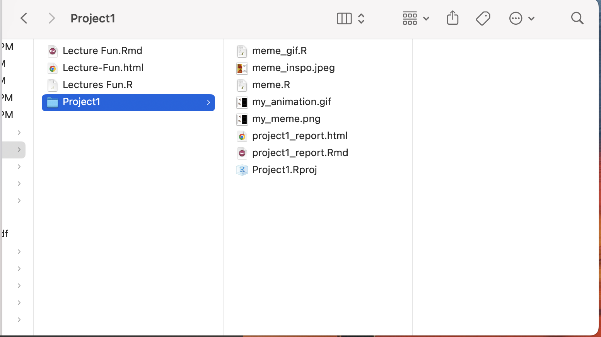
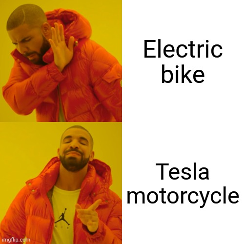
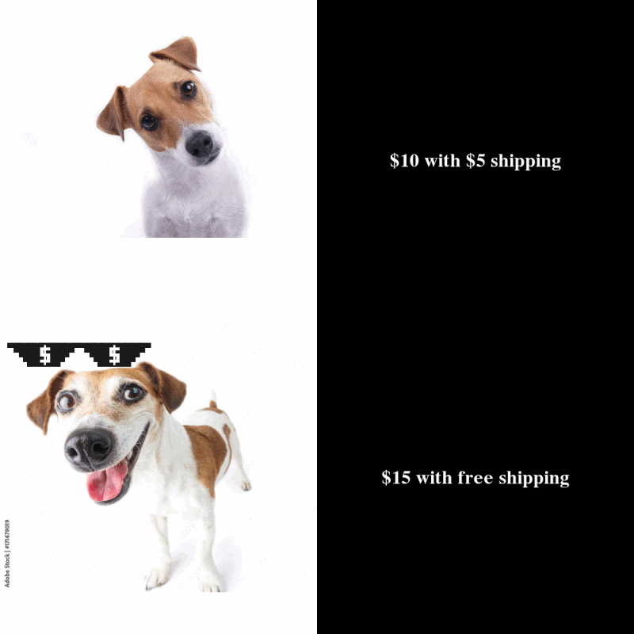

```{r setup, include=FALSE}
knitr::opts_chunk$set(echo=TRUE, message=FALSE, warning=FALSE, error=FALSE)
```


```{css}
body {
font-family: "Monaco";
}

h1 {
color: #ffb703;
background-color: #023047;
font-weight: bold
}

h2{
color: white;
background-color: #023047;
font-weight: bold
}
```


## Project requirements

I have set up a GitHub account for this project with a new repository called "stats220". Within this repository, I have created a README.md file. In my README.md file, I have used two different levels of headers, two different types of bullet points, bold and italics and also included links to other websites. The numbered list was used to list the top 3 activities I like to do in my free time, while the non-numbered list was used to list the subjects I'm taking this semester. The link to my LinkedIn website is also included in case people reading my page want to learn more about me.
[My Github Repo](https://github.com/joshnguyencodes/stats220)

###Screenshot of the project folder



## My meme

### Inspo meme


The key component I re-created was the format of the meme where there's 4 squares. The two on the left displays pictures while the two on the right displays the punch line of the joke. I components I changed were the pictures and the background colors of the text, as well as the content of the meme.

```{r meme-code, eval=TRUE}
library(magick)

#links to images
confused_dog_url <- "https://media.istockphoto.com/id/94740594/photo/intrigued.jpg?s=612x612&w=0&k=20&c=mn8cFeCJkdFFzyPtHgTjdM1EM8waO5-FB1IJO_Mz6gU="
happy_dog_url <- "https://as1.ftcdn.net/v2/jpg/01/71/47/90/1000_F_171479019_6UvsiH5Erd8m3GCcCC5AdhVwpiqkfvJb.jpg"

#square 1
top_row_image <- image_read(confused_dog_url) %>%
  image_scale(500)

#square 2
top_row_text <- image_blank(width = 500,
                            height =500,
                            color = "#000000") %>%
  image_annotate(text = "$10 with $5 shipping",
                 color = "#FFFFFF",
                 size = 30,
                 font = "Calibri",
                 gravity = "center")
  

#square 3
bottom_row_image <- image_read(happy_dog_url) %>%
  image_scale(500)

#square 4
bottom_row_text <- image_blank(width=500,
                            height=500,
                            color="#000000") %>%
  image_annotate(text = "$15 with free shipping",
                 color = "#FFFFFF",
                 size = 30,
                 font = "Calibri",
                 gravity = "center")

#making first row
first_row <- image_append(c(top_row_image, top_row_text))

#making second row
second_row <- image_append(c(bottom_row_image, bottom_row_text))

#putting everything together
my_meme <- image_append(c(first_row, second_row), stack = TRUE) %>%
  image_scale(800)

#saving the meme as a png
image_write(my_meme, "my_meme.png")

#displaying the meme
my_meme

```

```{r animation-code, eval=FALSE}
# inspo_meme link https://imgflip.com/i/393ddh

library(magick)

#links to images
confused_dog_url <- "https://media.istockphoto.com/id/94740594/photo/intrigued.jpg?s=612x612&w=0&k=20&c=mn8cFeCJkdFFzyPtHgTjdM1EM8waO5-FB1IJO_Mz6gU="
happy_dog_url <- "https://as1.ftcdn.net/v2/jpg/01/71/47/90/1000_F_171479019_6UvsiH5Erd8m3GCcCC5AdhVwpiqkfvJb.jpg"
money_glasses_url = "https://png.pngtree.com/png-clipart/20221001/original/pngtree-modern-shades-sunglasses-money-vector-png-image_8647116.png" 


#square 1
top_row_image <- image_read(confused_dog_url) %>%
  image_scale(500)

#square 2
top_row_text <- image_blank(width = 500,
                            height =500,
                            color = "#000000") %>%
  image_annotate(text = "$10 with $5 shipping",
                 color = "#FFFFFF",
                 size = 30,
                 font = "Calibri",
                 gravity = "center")


#square 3
bottom_row_image <- image_read(happy_dog_url) %>%
  image_scale(500)


#square 4
bottom_row_text <- image_blank(width=500,
                               height=500,
                               color="#000000") %>%
  image_annotate(text = "$15 with free shipping",
                 color = "#FFFFFF",
                 size = 30,
                 font = "Calibri",
                 gravity = "center")


#making first row
first_row <- image_append(c(top_row_image, top_row_text))


#making second row
second_row <- image_append(c(bottom_row_image, bottom_row_text))


#putting everything together
my_meme <- image_append(c(first_row, second_row), stack = TRUE) %>%
  image_scale(800)

#money glasses image
glasses_image <- image_read(money_glasses_url) %>%
  image_scale(200) 


#creating each frame where the glasses keeps coming closer to the happy dog
frame_1 <- image_composite(my_meme, glasses_image, offset = "+0+345")

frame_2 <- image_composite(my_meme, glasses_image, offset = "+5+355")

frame_3 <- image_composite(my_meme, glasses_image, offset = "+10+365")

frame_4 <- image_composite(my_meme, glasses_image, offset = "+15+375")

frame_5 <- image_composite(my_meme, glasses_image, offset = "+20+385")

frame_6 <- image_composite(my_meme, glasses_image, offset = "+25+395")

frame_7 <- image_composite(my_meme, glasses_image, offset = "+25+395")

frame_8 <- image_composite(my_meme, glasses_image, offset = "+25+395")


#putting the frames in order using a vector
frames <- c(frame_1, frame_2, frame_3, frame_4, frame_5, frame_6, frame_7, frame_8)

#creating animation
my_meme_gif <- image_animate(frames, fps = 5)

image_write(my_meme_gif, "my_annimation.gif")

```



## Creativity

I have demonstrated creativity in this project through the creation of my meme. Firstly, I have used "image_composite" function of the "magick" library, which wasn't covered in the lectures/labs. In the lecture, we have only talked about how to put 2 images side by side or stack them up. In the creation of my meme, I needed to stack images on top of each other for my animation, which is why I used the "image_composite" function. 

## Learning reflection

I learned from module one how to use different tech stacks to create a final product. In our project, we made memes using R and the Magick package in R. We then used R Markdown and CSS to format and display our final product. It shows me how we can combine different technologies that cover various aspects of a product and combine them to make the final product. I'm curious to learn more about using the R and Magick packages to animate data and graphs. For example, interactive graphs or maps that allows us to filter data through animations. This can be very useful for users who need to be tech-savvy enough to explore data.


